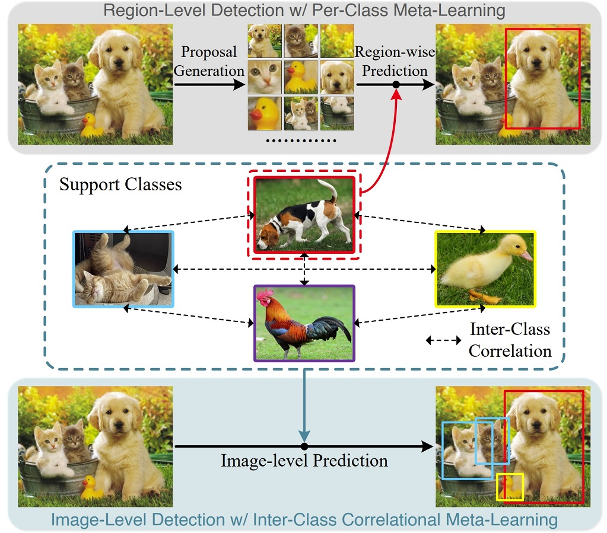
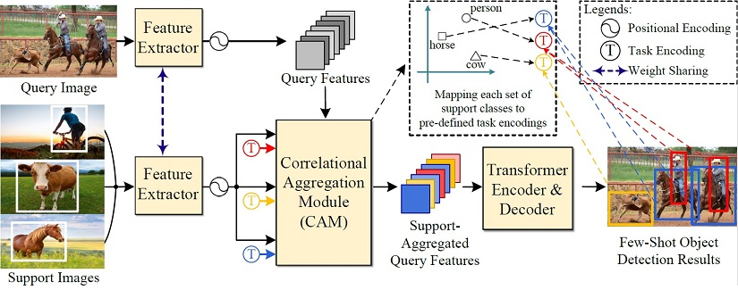

# __[T-PAMI' 2022]  Meta-DETR__   (Official PyTorch Implementation)

 

-------

This repository is the official PyTorch implementation of the
T-PAMI 2022 paper "[Meta-DETR: Image-Level Few-Shot Detection with Inter-Class Correlation Exploitation](https://arxiv.org/abs/2208.00219)" by _Gongjie Zhang, Zhipeng Luo, Kaiwen Cui, Shijian Lu, and Eric P. Xing_. 

<b> [ Important Notice ] </b> &nbsp;&nbsp; Meta-DETR first appeared as a tech report on arXiv.org (https://arxiv.org/abs/2103.11731v2) in 2021. Since its release, we have made substantial improvements to the original version. This repository corresponds to [the final published version accepted by IEEE Transactions on Pattern Analysis and Machine Intelligence (T-PAMI) in 2022](https://doi.org/10.1109/TPAMI.2022.3195735). Please kindly be advised to refer to the latest version of the paper.

-------

## Brief Introduction

Meta-DETR is a state-of-the-art few-shot object detector that performs image-level meta-learning-based prediction and effectively exploits the inter-class correlation to enhance generalization from old knowledge to new classes. Meta-DETR entirely bypasses the proposal quality gap between base and novel classes, thus achieving superior performance than R-CNN-based few-shot object detectors. In addition, Meta-DETR performs meta-learning on a set of support classes at one go, thus effectively leveraging the inter-class correlation for better generalization.

&nbsp;

  

  

Environment:
Ubuntu 18.04 LTS
Python 3.7
Pytorch 1.7.1
Cuda 10.2

